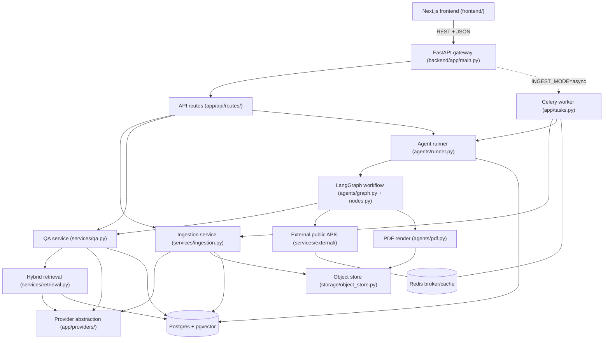

<!-- generated-by: gsd-doc-writer -->
# Architecture

## System Overview

ProofPack AI is a multimodal disaster-claim intelligence platform. Users create a **claim**,
upload **documents** (PDFs, scanned forms, photos, invoices, receipts, inspection reports,
voice notes), and the backend ingests each artifact into a per-claim retrieval index. The
system answers questions over that evidence with inline citations, then runs a multi-agent
workflow that verifies the event against public data (FEMA/NWS), analyses policy coverage,
detects evidence gaps, and assembles a cited, human-reviewable **claim packet** (markdown + PDF).

Architecturally it is a **layered, service-oriented backend** (FastAPI gateway → service
modules → Postgres/pgvector + object storage) fronted by a single-page Next.js client, with an
optional **Celery worker** for asynchronous ingestion and workflow execution. Two design
principles run through the whole system: every model call flows through a **pluggable provider
abstraction** that falls back to deterministic, key-free stubs, and every external integration
and agent node **degrades rather than crashes** — failures return placeholders or `unverified`
state instead of raising out of a request or worker.

## Component Diagram



The major modules and their roles:

- **Frontend** (`frontend/`) — Next.js 14 App Router client; all calls go through `frontend/lib/api.ts`.
- **FastAPI gateway** (`backend/app/main.py`) — mounts routers, CORS, and runs the DB bootstrap on startup.
- **API routes** (`backend/app/api/routes/`) — `claims`, `documents`, `qa`, `packets`, `health`.
- **Provider abstraction** (`backend/app/providers/`) — runtime-resolved LLM, embedding, and OCR providers.
- **Services** (`backend/app/services/`) — ingestion, chunking, retrieval, QA, and external API clients.
- **Agents** (`backend/app/agents/`) — the LangGraph claim-packet workflow and supporting nodes.
- **Persistence** — Postgres + pgvector (`backend/app/db/`) and an object store (`backend/app/storage/`).
- **Async execution** — Celery (`backend/app/celery_app.py`, `backend/app/tasks.py`) backed by Redis.

## Data Flow

The HTTP and workflow surface (route prefixes from `backend/app/api/routes/`):

```
POST /claims                          → create a claim
POST /claims/{id}/documents           → store blob + Document; ingest sync OR enqueue Celery
POST /claims/{id}/qa                  → hybrid_search → LLM.answer → log QARun (traced)
POST /claims/{id}/packet              → AgentRun → LangGraph workflow → ClaimPacket (+ PDF)
GET  /claims/{id}/packet/runs/{rid}   → poll workflow status
GET  /claims/{id}/packet/latest       → fetch most recent packet
POST /claims/{id}/packet/{pid}/review → human approve / edit
GET  /claims/{id}/packet/{pid}/pdf    → download packet PDF
GET  /providers                       → report which provider implementation is live
GET  /health                          → liveness + version
```

**Ingestion flow** (`backend/app/services/ingestion.py`). Ingestion is split into two steps so it
can run inline or on a worker:

1. The upload route (`api/routes/documents.py`) validates `source_type` against a fixed vocabulary
   (`policy | invoice | receipt | photo | inspection | permit | voicenote | other`).
2. `store_document` persists the raw blob via the object store and creates the `Document` row with
   status `processing`.
3. `process_document` runs OCR/parse → chunk → embed → writes `Chunk` rows, then marks the document
   `ready` (or `failed` on error, never raising out of the worker).
4. In **sync** mode (`INGEST_MODE=sync`) `ingest_document` chains both steps inside the request and
   returns `chunks_created`. In **async** mode (`INGEST_MODE=async`) the route enqueues
   `app.tasks.process_document_task`, returns `chunks_created=0`, and the frontend polls the
   documents list until status flips to `ready`.

**QA flow** (`backend/app/services/qa.py`). For a question, `hybrid_search` retrieves the top-k
chunks; each becomes a 1-based `RetrievedContext`; the active LLM produces an answer with `[n]`
citation markers; those markers are mapped back to chunk metadata to build `Citation` objects; a
`QARun` audit row is persisted; and the entire call is wrapped in a PII-redacted trace span.

**Workflow flow** (`backend/app/agents/`). `POST /claims/{id}/packet` creates an `AgentRun` and runs
the LangGraph workflow (inline when sync, via `app.tasks.run_packet_task` when async). The seven
linear nodes execute in order:

1. **intake** — geocode the claim location via Nominatim.
2. **extraction** — per-document structured field extraction; persists `ExtractionResult` rows.
3. **verification** — cross-check the incident against FEMA (authoritative) and NWS (supplementary);
   persists a `VerificationResult`.
4. **policy_rag** — answer standard coverage questions through the claim-scoped cited RAG.
5. **gap_analysis** — flag required evidence (by `source_type`) that is missing for the incident type.
6. **report_writer** — assemble the packet markdown deterministically and compute a confidence score
   plus the human-review flag.
7. **human_review** — terminal checkpoint annotating why review is (or is not) required.

The runner (`agents/runner.py`) renders the markdown to PDF, persists a `ClaimPacket`, and advances
the claim lifecycle to `review` or `ready`.

## Key Abstractions

The most significant abstractions, with file locations:

- **Provider Protocols** — `backend/app/providers/base.py` defines `LLMProvider`, `EmbeddingProvider`,
  and `OCRProviderProto` Protocols, plus the `RetrievedContext`, `AnswerResult`, and `OCRResult`
  dataclasses that all model calls pass through.
- **Provider factories** — `get_llm`, `get_embedder`, `get_ocr` (`backend/app/providers/llm.py`,
  `embeddings.py`, `ocr.py`). Each is an `@lru_cache`d singleton that resolves a concrete
  implementation at runtime from env config + key presence (priority: Gemini key → OpenAI key →
  stub). Hosted providers fall back to the stub on any error.
- **`hybrid_search`** — `backend/app/services/retrieval.py`. Claim-scoped retrieval fusing a pgvector
  cosine ANN search and a Postgres full-text search with weighted Reciprocal Rank Fusion.
- **`answer_question`** — `backend/app/services/qa.py`. Orchestrates retrieval → LLM → citation
  mapping → `QARun` persistence inside a trace span.
- **`run_graph` / `ClaimState`** — `backend/app/agents/graph.py` and `agents/state.py`. Compiles the
  node sequence into a LangGraph `StateGraph`, with a sequential fallback executor if LangGraph is
  unavailable; `ClaimState` is the `TypedDict` threaded through every node.
- **Workflow nodes** — `backend/app/agents/nodes.py`. Seven small agents (intake, extraction,
  verification, policy_rag, gap_analysis, report_writer, human_review), each `state in → partial
  state update out`, none of which raise.
- **`ObjectStore` Protocol** — `backend/app/storage/object_store.py`. Resolves `LocalObjectStore` or
  `S3ObjectStore` from `STORAGE_BACKEND`.
- **`Settings`** — `backend/app/config.py`. The single `settings` singleton for all env-driven
  configuration; the embedding dimension (default 768) is bound here and read by the ORM at import.
- **`traced` / `redact`** — `backend/app/observability.py`. Opt-in tracing context manager and the
  PII redaction applied to all traced inputs/outputs.

## Retrieval and RAG Pipeline

Retrieval is **always claim-scoped** and computed **in the database** so it scales past an in-Python
scan (`backend/app/services/retrieval.py`):

- **Vector candidates** — an HNSW cosine-distance search over `chunks.embedding`, backed by the
  `ix_chunks_embedding_hnsw` index (`USING hnsw (embedding vector_cosine_ops)`).
- **Keyword candidates** — a Postgres full-text search using `to_tsvector('english', text)` and
  `plainto_tsquery`, ranked by `ts_rank` and backed by the `ix_chunks_text_fts` GIN index. FTS
  failures degrade to vector-only.
- **Fusion** — the two ranked lists are merged with **weighted Reciprocal Rank Fusion**: each list
  contributes `weight * 1 / (RRF_K + rank)`, with `VECTOR_WEIGHT = 0.7`, `KEYWORD_WEIGHT = 0.3`, and
  `RRF_K = 60`. The candidate pool is `top_k * 6` per list before fusion.

Upstream, chunking (`backend/app/services/chunking.py`) uses page-aware overlapping word windows of
180 words with 40-word overlap, preserving page numbers so citations can reference a specific page.
Embeddings share a single `EMBEDDING_DIM` (default **768**, Gemini-aligned) that is bound to the
`Chunk.embedding` column at import time; changing it invalidates already-stored vectors.

## Provider Abstraction

Every model call — LLM, embeddings, OCR — flows through `backend/app/providers/`. Each `get_*()`
factory resolves a concrete implementation at runtime from env config and key presence; when the
relevant `*_PROVIDER` is `auto` the priority is **Gemini key → OpenAI key → stub**:

- **LLM** (`get_llm`): `GeminiLLM` (`gemini-2.5-flash`) → `OpenAILLM` → `StubLLM` (an extractive,
  citation-preserving fallback that selects the evidence sentences best overlapping the question).
- **Embeddings** (`get_embedder`): `GeminiEmbedder` (`gemini-embedding-001` at 768 dimensions) →
  `OpenAIEmbedder` (output dimension pinned to 768) → `StubEmbedder` (deterministic hashed
  bag-of-words producing L2-normalized vectors). All share `EMBEDDING_DIM`.
- **OCR / multimodal** (`get_ocr`): `GeminiVisionOCR` (images → OCR + damage description, audio →
  transcription) → `HFOCR` → `TesseractOCR` (offline) → `StubOCR`. **PDF and plain-text extraction
  are always real (pypdf)** regardless of which provider is active.

The stubs make the entire system run with zero API keys, deterministically and offline. Factories
are `@lru_cache`d singletons, so changing provider env vars after the process starts does not
re-resolve them. `GET /providers` reports which implementation is currently live. Google SDK imports
are lazy (inside the provider classes) so the app imports without `google-genai` installed.

## Agent Workflow

The claim-packet workflow (`backend/app/agents/`) is a linear LangGraph state machine compiled in
`graph.py`. The node order is fixed: `intake → extraction → verification → policy_rag → gap_analysis
→ report_writer → human_review`. If LangGraph is unavailable, `run_graph` falls back to an equivalent
sequential executor so the workflow still runs.

- **`state.py`** — `ClaimState`, the `TypedDict` carrying claim inputs plus everything the nodes
  produce (geocode, extractions, verification, coverage QA, gaps, citations, report markdown,
  confidence, review flag, notes).
- **`nodes.py`** — the seven node functions. Each receives a DB session (bound by closure in
  `graph.py`) and the running state, and never raises: a node failure records a note and yields
  neutral output so the graph still reaches a packet (possibly flagged for review).
- **`extraction.py`** — per-document structured extraction; uses Gemini JSON output when a key is
  present, otherwise a deterministic regex fallback (amounts/dates/policy numbers + a text summary).
- **`checklist.py`** — the per-incident required-evidence checklist (`flood`, `hurricane`, `hail`,
  `fire`, `storm`, `other`) used by the gap-analysis node.
- **`report.py`** — deterministic packet markdown assembly (`build_markdown`) and confidence scoring
  (`score_confidence`, a weighted blend of extraction confidence, verification, coverage answers,
  and gap completeness). A packet needs review when confidence < 0.6, the event is unverified, or any
  gap exists.
- **`pdf.py`** — renders the markdown to PDF via reportlab (pure-Python, no system libraries) and
  stores it through the object store; degrades to a markdown-only packet on any error.
- **`runner.py`** — creates the `AgentRun`, executes the graph (inline when sync, via
  `app.tasks.run_packet_task` when async), renders + stores the PDF, persists the `ClaimPacket`, and
  advances the claim status.

**External verification** (`backend/app/services/external/`) backs the verification node with three
keyless public APIs, each cached in Redis, retried with `tenacity` backoff, and sending a descriptive
`EXTERNAL_USER_AGENT`:

- **`geocode`** (Nominatim / OpenStreetMap) — resolves the claim location to coordinates and a state code.
- **`fema_disaster_declarations`** (OpenFEMA) — the authoritative event-occurred signal; filters
  declarations by state and a date window (and optionally incident type).
- **`nws_context`** (api.weather.gov) — supplementary context: a forecast office and any active alerts.

## Data Model

The relational schema is defined in `backend/app/db/models.py`. The core hierarchy is
`Claim` 1—N `Document` 1—N `Chunk`, with `QARun` logging each QA call. Month-2 tables capture agent
workflow outputs.

| Table | Purpose |
| ----- | ------- |
| `claims` | Unit of work: title, claimant, incident type/date, location, status. |
| `documents` | Uploaded artifact: filename, content type, `source_type`, storage path, page count, OCR confidence, status. |
| `chunks` | Retrievable unit: text, page number, `source_type`, token count, `Vector(embedding_dim)` embedding; denormalised `claim_id` for claim-scoped queries. |
| `qa_runs` | Audit of each QA call: question, answer, retrieved chunk ids, citations, LLM provider, latency. |
| `agent_runs` | One execution of the claim-packet workflow: workflow name, status, serialized state, error, latency. |
| `extraction_results` | Per-document structured fields extracted by the extraction node, with confidence and provider. |
| `verification_results` | FEMA/NWS/geocode outcome for a claim's incident, plus a `verified` flag and summary. |
| `claim_packets` | A generated packet: markdown, PDF storage path, confidence, review flag, status (`draft`/`approved`), citations, gaps, verification. |

`Chunk.embedding` is `Vector(settings.embedding_dim)` bound at import time (`EMBEDDING_DIM` defaults
to **768**); changing the dimension invalidates stored vectors, so the `chunks` table must be
recreated. Foreign keys cascade on delete from `Claim` downward.

## Schema Lifecycle and Indexes

On startup the FastAPI `lifespan` (`backend/app/main.py`) runs an idempotent dev bootstrap
(`_init_db`): it creates the `vector` and `pg_trgm` extensions, runs `Base.metadata.create_all`, then
applies the performance indexes from `backend/app/db/indexes.py`. Those indexes are kept separate
from the model definitions because they are expression / operator-class indexes that `create_all`
does not emit:

- `ix_chunks_embedding_hnsw` — HNSW cosine ANN over `chunks.embedding`.
- `ix_chunks_text_fts` — GIN over `to_tsvector('english', text)` for full-text retrieval.
- `ix_chunks_text_trgm` — GIN trigram index over `chunks.text`.

Production uses **Alembic** (`alembic upgrade head`) where the baseline migration materialises the
same metadata and indexes. Models must be imported before `create_all`/autogenerate runs, which is
why `main.py` imports `app.db.models` for its registration side effect.

## Object Storage and Async Execution

Document blobs and generated PDFs are persisted through `backend/app/storage/object_store.py`, which
resolves `LocalObjectStore` (filesystem under `STORAGE_LOCAL_DIR`) or `S3ObjectStore` (boto3,
compatible with Railway buckets, Cloudflare R2, MinIO, and S3) from `STORAGE_BACKEND`. A
`storage_path` is a path relative to the local root or an object key; the worker and the PDF download
route read it back.

Asynchronous work runs on Celery (`backend/app/celery_app.py`) with Redis as both broker and result
backend (`REDIS_URL`). Two tasks live in `backend/app/tasks.py`: `process_document_task` (worker-side
ingestion, retried with backoff up to 3 times) and `run_packet_task` (worker-side workflow execution).
Redis also backs the response cache for the external public-API clients (`backend/app/cache.py`).

## Observability

Tracing (`backend/app/observability.py`) is opt-in: it is a no-op unless `TRACING_ENABLED` is set and
Langfuse keys are configured, and it degrades silently if Langfuse is unavailable. The `traced`
context manager wraps QA (and is available to other calls) and records inputs, outputs, and metadata
(provider, latency, citation count). Crucially, all inputs and outputs are **PII-redacted** before
leaving the process — emails, phone numbers, SSNs, and card-like numbers are masked by `redact`.

## Frontend

The frontend (`frontend/`) is a Next.js 14 App Router application with a single client page,
`frontend/app/page.tsx`. It composes a claim sidebar plus, for the selected claim, an upload panel,
a QA panel, and a packet panel (`frontend/components/`: `ClaimSidebar`, `UploadPanel`, `QAPanel`,
`PacketPanel`, `ProviderBadge`). The upload panel polls the documents list every two seconds while
any document is still `processing`, which supports the async ingestion path. All HTTP calls go
through `frontend/lib/api.ts`, whose base URL comes from `NEXT_PUBLIC_API_BASE_URL` (default
`http://localhost:8000`); the request/response shapes in `frontend/lib/types.ts` mirror the backend
Pydantic schemas in `backend/app/schemas.py`.

## Directory Structure Rationale

```
ProofPack_AI/
├── backend/
│   ├── app/
│   │   ├── main.py            # FastAPI entrypoint: routers, CORS, DB bootstrap
│   │   ├── config.py          # Centralized settings singleton (read env only here)
│   │   ├── celery_app.py      # Celery app (Redis broker/backend)
│   │   ├── tasks.py           # Async ingestion + workflow tasks
│   │   ├── cache.py           # Redis response cache for external APIs
│   │   ├── observability.py   # PII redaction + opt-in Langfuse tracing
│   │   ├── schemas.py         # Pydantic request/response models
│   │   ├── api/routes/        # HTTP endpoints: claims, documents, qa, packets, health
│   │   ├── providers/         # Runtime-resolved LLM / embedding / OCR providers
│   │   ├── services/          # Ingestion, chunking, retrieval, QA, external API clients
│   │   ├── agents/            # LangGraph claim-packet workflow + nodes + report/pdf
│   │   ├── db/                # ORM models, session/engine, indexes
│   │   └── storage/           # Local + S3-compatible object stores
│   ├── alembic/               # Production schema migrations
│   └── evals/                 # HTTP-driven eval harness (CI quality gate)
├── frontend/
│   ├── app/                   # Next.js App Router (single client page + layout)
│   ├── components/            # Claim sidebar, upload, QA, packet, provider badge
│   └── lib/                   # api.ts (HTTP client) + types.ts (schema mirror)
└── docs/                      # Project documentation
```

Top-level directories:

- **`backend/`** — the FastAPI service, organized so that each concern lives in one place: HTTP in
  `api/`, model inference behind `providers/`, business logic in `services/`, the agent workflow in
  `agents/`, persistence in `db/`, and blob storage in `storage/`.
- **`frontend/`** — the Next.js client, with `lib/` isolating the API client and the type mirror that
  must stay in sync with the backend schemas.
- **`docs/`** — project documentation, including the system-design overview.

The split between `services/` and `agents/` reflects the two product capabilities (Month 1 cited RAG
QA vs. Month 2 multi-agent packet generation), while `providers/` is deliberately the single point
every model call passes through so providers can be swapped at runtime without touching callers.
