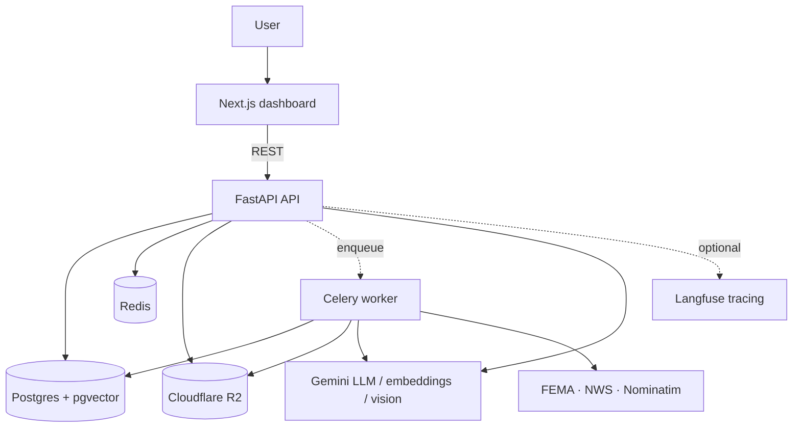
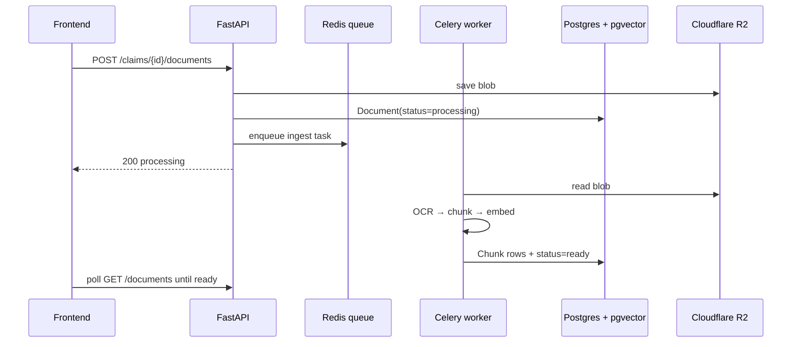
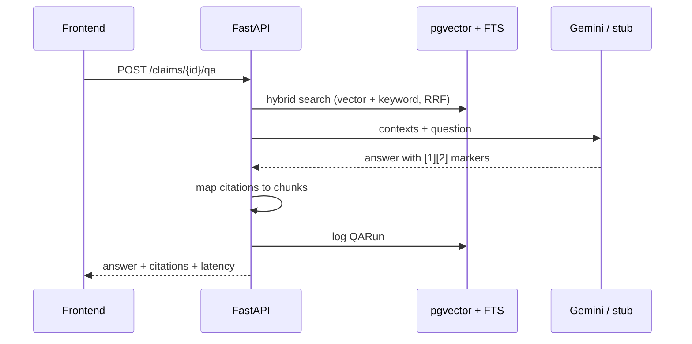
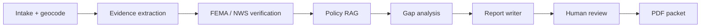

# ProofPack AI

**Multimodal disaster-claim intelligence — RAG, agents, and evidence-backed packet generation**

| | |
| --- | --- |
| **Live frontend** | https://frontend-cyan-iota-66.vercel.app |
| **API / docs** | https://proofpack-api-production-ed2f.up.railway.app/docs |
| **Repository** | https://github.com/dhirenmahajan/ProofPack_AI |
| **Stack** | Next.js · FastAPI · PostgreSQL + pgvector · Redis · Celery · LangGraph · Google Gemini · Cloudflare R2 · Railway · Vercel |

---

## One-liner

ProofPack AI helps property owners and small businesses assemble **insurance and disaster claim packets** after floods, fires, and storms. Users upload real-world evidence (PDFs, photos, invoices, voice notes); the system **ingests, retrieves, cites, verifies against FEMA/NWS**, and generates a **human-reviewable claim packet** with confidence scores and gap analysis.

---

## The problem

After a disaster, claimants face a painful paperwork problem:

- Evidence is **multimodal** — policies, receipts, inspection reports, photos, voice memos.
- Insurers need **traceable support** — every figure and coverage statement should tie back to a source.
- Public disaster context (declarations, weather alerts, location) must be **cross-checked**, not guessed.
- Most “chat with your PDF” tools **hallucinate** and do not produce a structured, submission-ready packet.

ProofPack is built as a **production-shaped AI system**, not a demo chatbot: ingestion, retrieval, agents, evaluation, async workers, and cloud deployment are all first-class.

---

## What it does

### User journey

1. **Create a claim** — incident type, date, location, claimant.
2. **Upload evidence** — policy PDFs, invoices, photos, permits, voice notes, and more.
3. **Ask questions** — hybrid RAG returns answers with **inline `[n]` citations** (filename, page, snippet, score).
4. **Generate a claim packet** — a LangGraph workflow geocodes the loss, verifies against **FEMA/NWS**, runs policy RAG, flags **missing documents**, and outputs markdown plus a **downloadable PDF**.
5. **Human review** — approve or edit before anything is treated as final.

### Technical capabilities

| Capability | Implementation |
| --- | --- |
| Multimodal ingestion | OCR/parse → page-aware chunking → embeddings → pgvector |
| Cited Q&A | Hybrid retrieval (vector + FTS) fused with RRF; citation mapping from LLM output |
| Agent workflow | LangGraph: intake → extraction → verification → policy RAG → gaps → report → review |
| External verification | Keyless FEMA, NWS, Nominatim with caching, backoff, graceful `unverified` |
| Provider abstraction | Gemini → OpenAI → deterministic stubs; **zero API keys** still runs end-to-end |
| Scale path | FastAPI + **Celery worker** + Redis queue; async ingestion in production |
| Object storage | Cloudflare **R2** (S3-compatible) for blobs and generated PDFs |
| Quality gate | HTTP eval harness: Recall@K, faithfulness, citation accuracy, schema validity |
| Observability | Optional Langfuse tracing with PII redaction |
| CI | GitHub Actions: smoke test + eval subset + frontend build |

---

## System architecture

### High-level



### Layered view

```text
┌─────────────────────────────────────────────────────────────┐
│  Frontend (Next.js 14, TypeScript, Tailwind)                │
│  Claim sidebar · upload · QA · packet panel                 │
└───────────────────────────┬─────────────────────────────────┘
                            │ REST / JSON
┌───────────────────────────▼─────────────────────────────────┐
│  API Gateway (FastAPI)                                      │
│  claims · documents · qa · packets · health · providers     │
└───────┬───────────────────────────────┬─────────────────────┘
        │ sync or async                 │
        ▼                               ▼
┌───────────────┐              ┌────────────────┐
│  Services     │              │  Celery worker │
│  ingestion    │◄─────────────│  (background)  │
│  retrieval    │              └────────────────┘
│  qa           │
│  external API │
└───────┬───────┘
        │
        ▼
┌───────────────────────────────────────────────────────────────┐
│  Persistence                                                  │
│  Postgres (claims, documents, chunks, QARuns, packets)          │
│  pgvector HNSW + Postgres FTS (hybrid search)                 │
│  R2 / local FS for raw blobs + PDFs                           │
└───────────────────────────────────────────────────────────────┘
```

### Ingestion (sync vs async)

In **production**, uploads are **async**: the API responds immediately; a **Celery worker** runs OCR, chunking, and embedding in the background.



### Cited Q&A (RAG)



**Retrieval:** claim-scoped hybrid search — pgvector cosine (HNSW) + Postgres full-text, fused with **Reciprocal Rank Fusion** (0.7 vector / 0.3 keyword). Every answer is persisted as a `QARun` for audit and evaluation.

### Agent workflow (claim packet)



Each node has a **deterministic fallback** so the workflow completes even without API keys (stubs + `unverified` flags).

---

## Architecture decisions

### 1. Provider abstraction as the center of gravity

Every LLM, embedding, and OCR call routes through cached factories (`get_llm`, `get_embedder`, `get_ocr`). Priority: **Gemini → OpenAI → stub**. Stubs are not mocks — they perform real PDF extraction, real cosine similarity, and extractive cited answers. The app **degrades, never crashes**.

### 2. Split ingestion: fast store, slow process

`store_document()` writes the blob and database row quickly; `process_document()` does heavy OCR, chunking, and embedding. That split enables **sync mode** (local dev) and **async mode** (production Celery) without duplicating logic.

### 3. Claim-scoped retrieval

Chunks carry denormalized `claim_id` so every search is isolated per claim — no cross-claim leakage and simpler operations than a global index.

### 4. Evidence-first outputs

QA and packets require **citations** mapped to concrete chunks (filename, page, snippet, score). The eval harness measures citation precision and faithfulness, not just fluency.

### 5. Scalable production topology

| Service | Role |
| --- | --- |
| `proofpack-api` | HTTP gateway |
| `proofpack-worker` | Celery — ingestion + packet runs |
| Postgres | pgvector + relational data |
| Redis | Celery broker + external API cache |
| Cloudflare R2 | Document blobs + PDFs |
| Vercel | Next.js frontend |

Deploys from GitHub (`main`) → Railway auto-build on push.

---

## Production deployment

```text
GitHub (dhirenmahajan/ProofPack_AI)
        │ push → auto-deploy
        ▼
Vercel frontend ──→ Railway API ──→ Postgres / Redis
                           │ enqueue
                           ▼
                    Railway Celery worker
                           │
                           ▼
                    Cloudflare R2 (proofpack bucket)
```

**Verified end-to-end:**

- Smoke test: claim → upload → async ingest → cited QA
- Eval gate: Recall@5, faithfulness, schema validity — **PASS**
- R2 round-trip upload/read
- Production smoke test against live Railway API

---

## Tech stack

| Layer | Technologies |
| --- | --- |
| Frontend | Next.js 14, TypeScript, Tailwind, App Router |
| Backend | FastAPI, Pydantic v2, SQLAlchemy 2.0, Alembic |
| AI / ML | Google Gemini (LLM, embeddings, vision), LangGraph, hybrid RAG |
| Data | PostgreSQL, pgvector (HNSW), Postgres FTS, Redis |
| Async | Celery, Redis broker |
| Storage | Cloudflare R2 (S3 API), boto3 |
| External data | FEMA Open API, NWS, OpenStreetMap Nominatim |
| DevOps | Docker Compose, Railway, Vercel, GitHub Actions |
| Observability | Langfuse (opt-in), structured `QARun` logging |
| Eval | Custom HTTP harness (`backend/evals/`) |

---

## Results (eval harness)

Example gated subset scores:

| Metric | Score |
| --- | --- |
| Recall@5 | 1.0 |
| Faithfulness | ~0.98 |
| Citation precision | 1.0 |
| Schema validity | 1.0 |

Production uses **Gemini** for LLM, embeddings, and multimodal OCR with **768-dim** embeddings (`gemini-embedding-001`).

---

## What this project demonstrates

- **End-to-end AI product engineering** — not just a notebook or chat wrapper
- **RAG done responsibly** — hybrid retrieval, citations, eval gates
- **Agentic workflows** — LangGraph with human-in-the-loop and external verification
- **Production patterns** — async workers, object storage, migrations, CI, multi-service deploy
- **Resilient design** — stub fallbacks, graceful degradation, PII-aware tracing
- **Domain depth** — disaster insurance claims, FEMA/NWS integration, evidence gap analysis

---

## Role

Designed and built the full stack: FastAPI backend, Next.js frontend, LangGraph agents, pgvector retrieval, Celery async pipeline, Cloudflare R2 storage, Railway/Vercel deployment, and eval/CI harness.

---

## Elevator pitch

> Built **ProofPack AI**, a full-stack multimodal claim platform: FastAPI + pgvector RAG with inline citations, LangGraph agents for FEMA/NWS verification and PDF packet generation, Celery async ingestion, Cloudflare R2 storage, deployed on Railway/Vercel with Gemini and a key-free stub fallback for offline dev and CI.

---

## Suggested portfolio assets

1. **Dashboard** — claim sidebar + upload panel
2. **QA panel** — answer with numbered citations expanded
3. **Packet panel** — generate / status / download PDF
4. **Architecture diagram** — export Mermaid diagrams above as PNG
5. **API docs** — `/docs` Swagger screenshot
6. **CI / eval** — GitHub Actions green + eval scorecard
