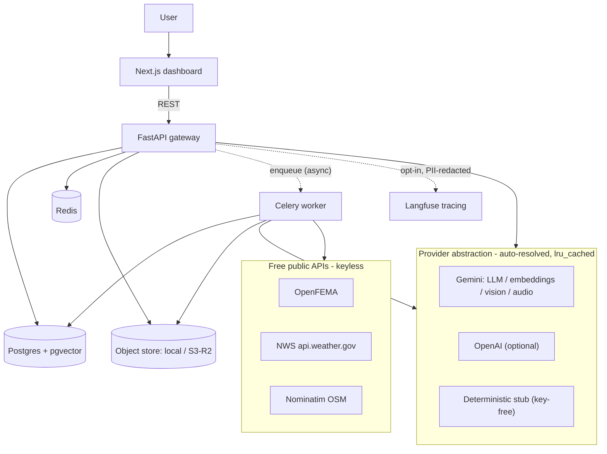
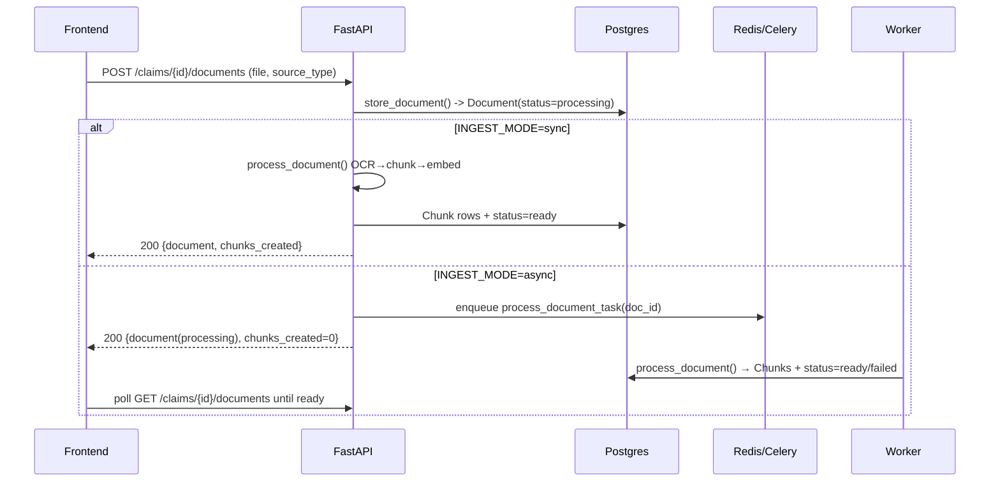
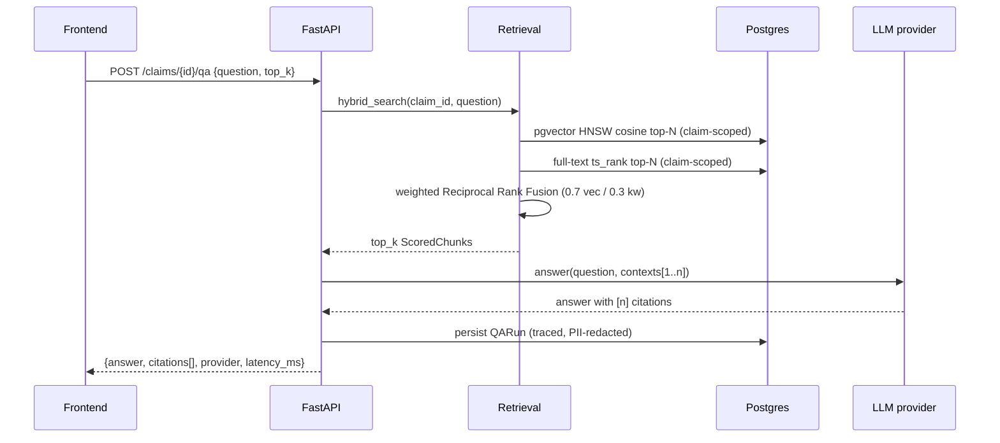
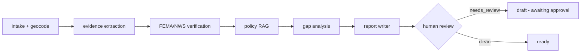
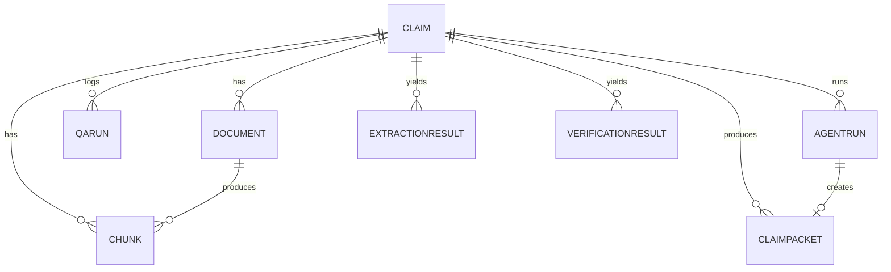
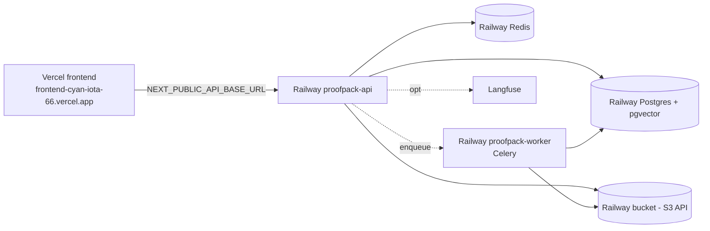

# ProofPack AI — How It Works (End to End)

This document explains **exactly** how ProofPack AI works: every request path, the
provider abstraction, the agent workflow, the data model, how it scales, how it's
evaluated and observed, and how to get the (free) API keys and deploy it.

For day-to-day contributor guidance see `CLAUDE.md`; for the agent contract see `AGENTS.md`.

---

## 1. What it does

A user creates a **claim**, uploads disaster-claim **evidence** (policy PDFs, invoices,
receipts, damage photos, inspection reports, permits, voice notes), and ProofPack:

1. **Ingests** each file (OCR/parse → chunk → embed → store vectors in pgvector).
2. Answers questions over that evidence with **inline citations** (hybrid RAG).
3. Runs a **multi-agent workflow** that geocodes the loss, **verifies** the disaster
   against FEMA/NWS, analyses coverage, detects **missing evidence**, and produces a
   cited, confidence-scored **claim packet** (markdown + PDF) with a **human-review** gate.

It is **free-API first** (Google Gemini + keyless public APIs) and runs with **zero keys**
on deterministic stub providers.

---

## 2. High-level architecture



Layers: **frontend** (`frontend/`), **gateway** (`backend/app/api`), **services**
(`backend/app/services`: ingestion, chunking, retrieval, qa, external), **agents**
(`backend/app/agents`), **providers** (`backend/app/providers`), **storage/db**
(`backend/app/storage`, `backend/app/db`).

---

## 3. Provider abstraction (the core design)

Every model call routes through a `@lru_cache`d factory in `backend/app/providers/`. With
`*_PROVIDER=auto` the resolution priority is **Gemini key → OpenAI key → stub**:

| Capability | Factory | Hosted (free) | Fallback chain |
| ---------- | ------- | ------------- | -------------- |
| LLM (answers) | `get_llm` | `GeminiLLM` `gemini-2.5-flash` | OpenAI → `StubLLM` (extractive, cites) |
| Embeddings | `get_embedder` | `GeminiEmbedder` `gemini-embedding-001` (768-dim) | OpenAI (dim=768) → `StubEmbedder` (hashed BoW) |
| OCR / multimodal | `get_ocr` | `GeminiVisionOCR` (image OCR + damage desc, audio transcription) | HF → Tesseract (offline) → `StubOCR` |

PDF and plaintext extraction are **always real** (`pypdf`), so ingestion is genuinely
functional with no keys at all. Hosted providers **fall back to the stub on any error** —
the system degrades, never crashes. Google SDK imports are lazy, so the app imports even
without `google-genai` installed. `GET /providers` reports the live implementations.

> Because factories are cached singletons, changing provider env vars after boot won't
> re-resolve them — restart the process.

---

## 4. Request lifecycles

### 4.1 Create a claim

`POST /claims` → inserts a `Claim` (title, claimant, incident type/date, location, status).

### 4.2 Upload + ingestion (sync or async)



`store_document` persists the blob (local FS or S3/R2) and creates the `Document` row fast.
`process_document` reads the blob back, runs OCR (provider-resolved), chunks pages
(`chunking.py`: 180-word windows, 40 overlap, page numbers preserved), embeds the chunks,
and writes `Chunk` rows carrying `(document_id, claim_id, page_number, source_type, text,
embedding)`. On failure the document is marked `failed` rather than raising.

### 4.3 Cited QA (hybrid retrieval)



Retrieval is **always claim-scoped** and computed **in the database**: an HNSW cosine ANN
search over `chunks.embedding` and a Postgres `to_tsvector/ts_rank` search over
`chunks.text`, fused with **Reciprocal Rank Fusion** (`RRF_K=60`, weighted `0.7` vector /
`0.3` keyword). If FTS errors, retrieval degrades to vector-only. The LLM is instructed to
cite with `[n]`; QA maps those markers back to chunk metadata (filename, page, snippet,
score). Every answer is logged as a `QARun` (the LLMOps audit trail).

### 4.4 Agent workflow → claim packet



`POST /claims/{id}/packet` creates an `AgentRun` and runs the **LangGraph** state machine
(`app/agents/graph.py`), either inline (sync) or via `run_packet_task` (async, polled at
`GET /claims/{id}/packet/runs/{run_id}`). Node-by-node (full contract in `AGENTS.md`):

1. **intake** — geocodes `location` via Nominatim → coordinates + US state.
2. **extraction** — per document, pulls structured fields (Gemini JSON, else regex
   fallback) and writes `ExtractionResult` rows.
3. **verification** — see §4.5; writes a `VerificationResult` and sets `verified`.
4. **policy_rag** — answers standard coverage questions via the cited RAG (§4.3).
5. **gap_analysis** — compares present `source_type`s against the per-incident checklist
   (`checklist.py`) and lists what's missing.
6. **report_writer** — deterministically assembles the packet markdown (`report.py`),
   computes a blended **confidence** score, and sets `needs_review`.
7. **human_review** — terminal checkpoint annotating why review is/ isn't required.

The packet is persisted as a `ClaimPacket` (markdown + citations + gaps + verification +
confidence + status) and rendered to **PDF** (`pdf.py`, reportlab) into the object store.
A human approves/edits via `POST /claims/{id}/packet/{packet_id}/review`; the PDF is served
at `GET /claims/{id}/packet/{packet_id}/pdf`.

### 4.5 Event verification (free public APIs)

`services/external/` holds three keyless clients, all Redis-cached with a descriptive
`EXTERNAL_USER_AGENT` and `tenacity` backoff, all degrading to "unverified" on failure:

- **Nominatim** (`geocode`) — address → `{lat, lon, state_code, …}` (≤1 req/s, cached).
- **OpenFEMA** (`fema_disaster_declarations`) — the **authoritative** signal: queries
  `DisasterDeclarationsSummaries` filtered by state + a ±30-day window around the incident
  date (+ mapped incident type). A match means a federal disaster was declared there/then.
- **NWS** (`nws_context`) — **supplementary**: resolves the forecast office and any active
  alerts for the point (historical confirmation via NWS is limited; FEMA is the strong one).

`verified = bool(FEMA match)`; an unverified event flags the packet for human review.

---

## 5. Data model



- **Claim** — unit of work (claimant, incident type/date, location, status).
- **Document** — uploaded artifact (filename, content/source type, storage path, page
  count, OCR confidence, status).
- **Chunk** — retrievable unit (text, page, source type, `Vector(EMBEDDING_DIM)` embedding);
  denormalised `claim_id` so retrieval filters by claim without a join.
- **QARun** — audit of every QA call (question, answer, retrieved chunk ids, citations,
  provider, latency).
- **AgentRun / ExtractionResult / VerificationResult / ClaimPacket** — the Month-2 records.

`EMBEDDING_DIM` (default **768** for Gemini) is bound into the `Chunk.embedding` column at
import; changing it invalidates stored vectors (recreate `chunks` / drop the volume).

---

## 6. How it scales

- **Async ingestion** — `INGEST_MODE=async` moves OCR/chunk/embed off the request thread to
  a **Celery** worker (Redis broker). Scale by adding worker replicas; the API stays responsive.
- **DB-side ANN + FTS** — retrieval uses an **HNSW** index for sub-linear cosine search and a
  **GIN** full-text index, instead of scanning in Python (`db/indexes.py`).
- **Stateless API + worker** — both read config from env, so they scale horizontally behind a
  load balancer; state lives in Postgres + Redis + object storage.
- **S3-compatible storage** — `S3ObjectStore` (R2/MinIO/S3) decouples blobs from the app disk.
- **Caching + backoff** — external API responses are cached in Redis with `tenacity` retries,
  respecting free-tier rate limits (esp. Nominatim ≤1 req/s).
- **Migrations** — **Alembic** (`alembic upgrade head`) for controlled schema evolution in
  prod; `create_all` remains the dev bootstrap.

---

## 7. Evaluation harness (`backend/evals/`)

HTTP-driven evals run against a **live backend**, so they test the real pipeline end to end,
key-free, in CI. `dataset.py` holds a seeded subset (synthetic policy + invoice with gold
Q/A); `metrics.py` scores Recall@5, MRR, nDCG, citation precision, keyword grounding,
**faithfulness** (token-overlap heuristic, or a **Gemini judge** when `GEMINI_API_KEY` is
set — Ragas-compatible), and schema validity. `run_evals.py` aggregates, writes
`evals/results.md`, and **gates** on Recall@5 (≥0.75) + faithfulness (≥0.5).

```bash
docker compose up --build -d
cd backend && python -m evals.run_evals --base-url http://localhost:8000
```

CI (`.github/workflows/ci.yml`) spins up postgres+redis, runs the smoke test + eval gate
(stub providers, `INGEST_MODE=sync`), and builds/typechecks the frontend.

---

## 8. Observability

`app/observability.py` provides PII redaction (emails, phones, SSNs, card numbers) and an
opt-in `traced()` context manager (Langfuse). QA is wrapped in a trace span recording
provider/latency/citation count with redacted I/O. Tracing is **off by default** and
**no-ops** if Langfuse isn't configured/installed — it never changes request behaviour.

---

## 9. Free API & account setup

All required inference is free; public data APIs are keyless.

| Service | Why | Get it | Env var(s) |
| ------- | --- | ------ | ---------- |
| **Google Gemini** | LLM, embeddings, vision/audio OCR | [aistudio.google.com/app/apikey](https://aistudio.google.com/app/apikey) → "Get API key" (free tier) | `GEMINI_API_KEY` |
| **OpenFEMA** | disaster verification | none (keyless) | `FEMA_API_BASE` (default set) |
| **NWS** | weather context | none — but set a real contact | `NWS_API_BASE`, `EXTERNAL_USER_AGENT` |
| **Nominatim (OSM)** | geocoding | none — set a real contact, ≤1 req/s | `NOMINATIM_API_BASE`, `EXTERNAL_USER_AGENT` |
| **Hugging Face** (optional) | alternative image OCR | [huggingface.co/settings/tokens](https://huggingface.co/settings/tokens) (read) | `HF_API_TOKEN` |
| **Supabase** (deploy) | Postgres + pgvector | [supabase.com](https://supabase.com) → new project → SQL: `create extension if not exists vector;` → copy the connection string | `DATABASE_URL_OVERRIDE` |
| **Upstash** (deploy) | Redis (Celery + cache) | [upstash.com](https://upstash.com) → create Redis → copy `rediss://` URL | `REDIS_URL` |
| **Cloudflare R2** (deploy) | object storage | [dash.cloudflare.com](https://dash.cloudflare.com) → R2 → create bucket + S3 API token | `STORAGE_BACKEND=s3`, `S3_*` |
| **Render** / **Railway** (deploy) | backend + worker | [render.com](https://render.com) / [railway.com](https://railway.com) | service env |
| **Vercel** (deploy) | frontend | [vercel.com](https://vercel.com) | `NEXT_PUBLIC_API_BASE_URL` |
| **Langfuse** (optional) | tracing | [cloud.langfuse.com](https://cloud.langfuse.com) → project keys | `TRACING_ENABLED=true`, `LANGFUSE_*` |

> `EXTERNAL_USER_AGENT` must contain a real contact (e.g. `ProofPackAI/1.0 (you@example.com)`)
> — NWS and Nominatim reject anonymous/abusive agents.

---

## 10. Run it locally

```bash
cp .env.example .env
# optional: put GEMINI_API_KEY=... in .env to upgrade off the stubs
docker compose up --build
# Frontend http://localhost:3000 · API docs http://localhost:8000/docs
```

Compose runs postgres+pgvector, redis, the API, a **Celery worker**, and the frontend; it
defaults to `INGEST_MODE=async`. Verify with `python backend/scripts/smoke_test.py`.

Backend without Docker: a local Postgres+pgvector, `pip install -r backend/requirements.txt`,
`uvicorn app.main:app --reload`, plus
`celery -A app.celery_app.celery_app worker --loglevel=info` if `INGEST_MODE=async`.

---

## 11. Cloud deployment

### 11.1 Live production (Railway + Vercel)



| Component | URL / name |
| --------- | ---------- |
| Frontend | https://frontend-cyan-iota-66.vercel.app |
| API + `/docs` | https://proofpack-api-production-ed2f.up.railway.app |
| GitHub repo | https://github.com/dhirenmahajan/ProofPack_AI |
| Railway project | [`proofpack-ai`](https://railway.com/project/9d9107ee-366c-4edf-ac0b-f8cc6c0670ee) — services: `proofpack-api`, `proofpack-worker`, `Postgres`, `Redis`, bucket `proofpack` |

Smoke test against production:

```bash
python backend/scripts/smoke_test.py https://proofpack-api-production-ed2f.up.railway.app
```

### 11.2 Railway scalable path (what we deployed)

**Deploy trigger:** connect both Railway services to GitHub (`dhirenmahajan/ProofPack_AI`,
branch `main`, root `backend/`). Every push to `main` rebuilds `proofpack-api` and
`proofpack-worker`. Manual fallback: `railway up --service …` from `backend/`.

1. **Postgres** — Railway managed Postgres; `CREATE EXTENSION vector` + `pg_trgm` run on API
   boot (`main.py` `_init_db`). Set `DATABASE_URL_OVERRIDE=${{Postgres.DATABASE_URL}}` —
   `config.py` rewrites `postgresql://` → `postgresql+psycopg://`.
2. **Redis** — `REDIS_URL=${{Redis.REDIS_URL}}` for Celery broker + cache.
3. **Object storage** — **Cloudflare R2** (recommended): `STORAGE_BACKEND=s3`,
   `S3_ENDPOINT_URL=https://<ACCOUNT_ID>.r2.cloudflarestorage.com`, keys from R2 API token.
   Setup: `./scripts/cloudflare_r2_setup.sh` → `./scripts/railway_apply_r2.sh`.
   (Railway bucket is an alternative — same `S3_*` shape.)
4. **API** — GitHub source, `backend/` root, **Dockerfile** builder (`backend/railway.json`),
   Dockerfile CMD binds `$PORT`, healthcheck `/health` on the **API service only**,
   `INGEST_MODE=async`, `EMBEDDING_DIM=768`, `GEMINI_API_KEY`.
5. **Worker** — same GitHub source + env as API; start command
   `celery -A app.celery_app.celery_app worker --loglevel=info --concurrency=2`; **no**
   HTTP healthcheck (do not share `/health` in `railway.json` — worker is not HTTP).
6. **Frontend** — Vercel project `frontend`; production env
   `NEXT_PUBLIC_API_BASE_URL=https://proofpack-api-production-ed2f.up.railway.app`.

### 11.3 Alternative free-tier topology

The same codebase also ships a **Render** blueprint (`render.yaml`) and supports
**Supabase** (Postgres), **Upstash** (Redis), and **Cloudflare R2** (blobs) if you prefer
not to host everything on Railway. See `.env.example` for the full variable matrix.

Tighten CORS in `app/main.py` (currently `*`) to the Vercel origin for production.

---

## 12. Configuration reference

All config is centralized in `backend/app/config.py` (read via the `settings` singleton);
`.env.example` documents every variable. Key ones:

| Var | Default | Purpose |
| --- | ------- | ------- |
| `LLM_PROVIDER` / `EMBEDDINGS_PROVIDER` / `OCR_PROVIDER` | `auto` | provider selection (auto = Gemini→OpenAI→stub) |
| `GEMINI_API_KEY` | — | enables hosted Gemini across LLM/embeddings/OCR |
| `EMBEDDING_DIM` | `768` | vector dimension bound into `chunks.embedding` |
| `INGEST_MODE` | `sync` (compose: `async`) | inline vs Celery ingestion |
| `STORAGE_BACKEND` / `S3_*` | `local` | local FS or S3/R2 object storage |
| `DATABASE_URL_OVERRIDE` | — | full DSN (e.g. Supabase) overriding `POSTGRES_*` |
| `REDIS_URL` | local | Celery broker + external-API cache |
| `EXTERNAL_USER_AGENT` | sample | required contact for NWS/Nominatim |
| `TRACING_ENABLED` / `LANGFUSE_*` | off | opt-in PII-redacted tracing |
